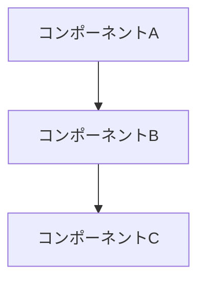
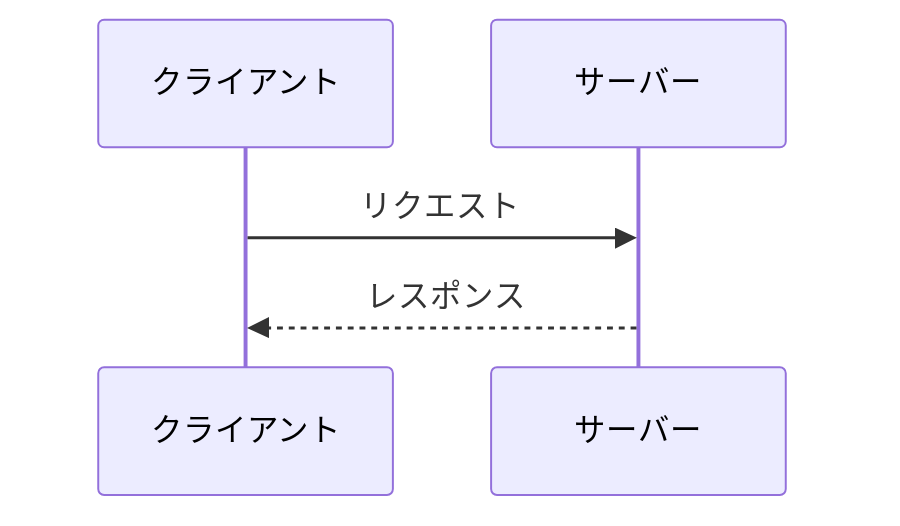

## 概要

<!-- このPRの目的を簡潔に説明してください -->

## 背景・課題

<!-- このPRを作成するに至った背景や解決すべき課題を説明してください -->

## 変更内容

### 追加されたファイル

<!-- 新規追加されたファイルとその目的を記載 -->

### 変更されたファイル

<!-- 変更されたファイルとその変更内容を記載 -->

### 削除されたファイル

<!-- 削除されたファイルがあれば記載 -->

## アーキテクチャ変更図

<!-- システムアーキテクチャの変更を示すMermaid図を追加してください -->



## データフロー

<!-- データの流れを示すMermaid図を追加してください -->



## テスト

### 単体テスト

<!-- 単体テストの実行方法と結果を記載 -->

```bash
# テスト実行コマンド
npm test
```

結果:

### 統合テスト手順

<!-- 統合テストや手動テストの手順を記載 -->

1.
2.
3.

## 影響範囲

### 影響を受けるコンポーネント

<!-- このPRの影響を受けるコンポーネントをリストアップ -->

-
-

### 破壊的変更

<!-- 破壊的変更がある場合は詳しく説明、なければ「なし」と記載 -->

なし

## チェックリスト

- [ ] 実装完了
- [ ] 全テストがパス
- [ ] ドキュメントを更新
- [ ] コミットメッセージが規約に準拠
- [ ] レビュー準備完了

## 備考

<!-- その他、レビュアーに伝えたい情報があれば記載 -->

---

Generated with [Claude Code](https://claude.com/claude-code)
